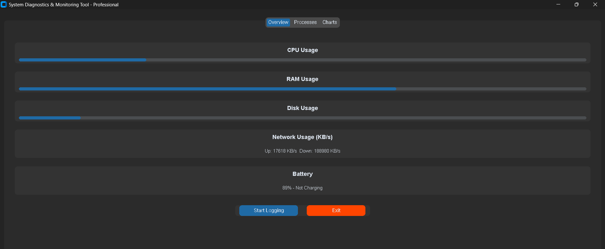
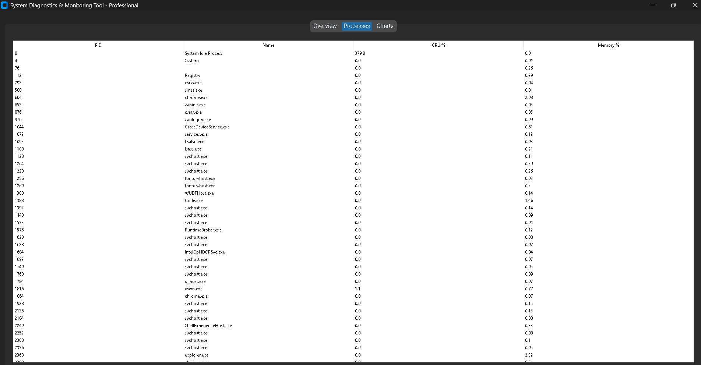
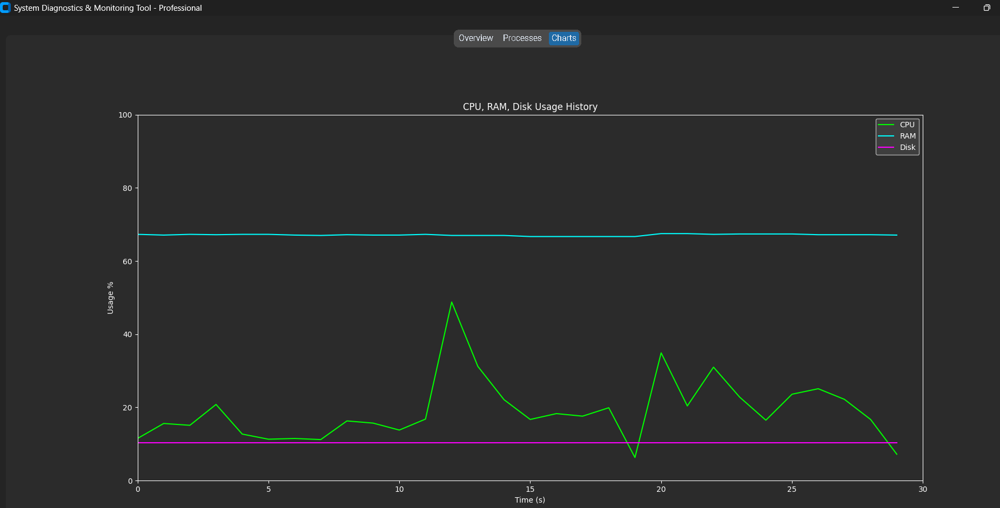

# 🖥️ System Monitoring GUI

A Python-based **System Monitoring GUI application** that provides real-time insights into your computer’s performance.  
It tracks **CPU usage, RAM utilization, Disk usage, and Battery health**, while also offering **process overviews, interactive charts, and CSV logging** for reports.  

---

## 🚀 Features

- 📊 **Real-time monitoring** of CPU, RAM, and Disk usage  
- 🔋 **Battery health and status** tracking  
- 📁 **CSV logging** for detailed reports  
- 📌 **Overview of running processes**  
- 📉 **Interactive charts** for system utilization  
- 🖥️ Built with **Tkinter / CustomTkinter** for a clean, modern GUI  

---

## 📂 Project Structure

SYSTEM MONITORING/
│── monitor.py # Basic system monitor (starter version)
│── monitor_professional.py # Advanced monitor version
│── monitor_customtkinter.py # CustomTkinter GUI version (recommended)
│── system_monitor_part2.py # Trial / prototype version
│── system_log_customtkinter.csv # Example system log output


---

## 🛠️ Technologies Used

- **Python 3**
- **Tkinter / CustomTkinter** – GUI framework  
- **psutil** – System performance monitoring  
- **matplotlib** – Charts & Graphs  
- **CSV handling** – Logging reports  

---

## ⚙️ Installation

1. **Clone this repository**:
   ```bash
   git clone https://github.com/your-username/system-monitoring-gui.git
   cd system-monitoring-gui

## Install dependencies:
    pip install psutil matplotlib customtkinter

## Run the application:
    python monitor_customtkinter.py

## 📖 Usage
    Run the CustomTkinter version for the best GUI experience:

    python monitor_customtkinter.py

## The application will display:

CPU, RAM, Disk usage

Battery percentage and status

System processes overview

Real-time usage charts

To log data into CSV, enable the logging option. Logs will look like this:
 Timestamp, CPU (%), RAM (%), Disk (%), Battery (%)
2025-09-20 11:30:00, 12, 58, 40, 95
2025-09-20 11:31:00, 18, 60, 41, 94

## 📸 Screenshots





## 🔮 Future Improvements

Export logs to Excel / JSON

Add network usage monitoring

Include alerts for high usage thresholds

Dark/Light mode toggle
